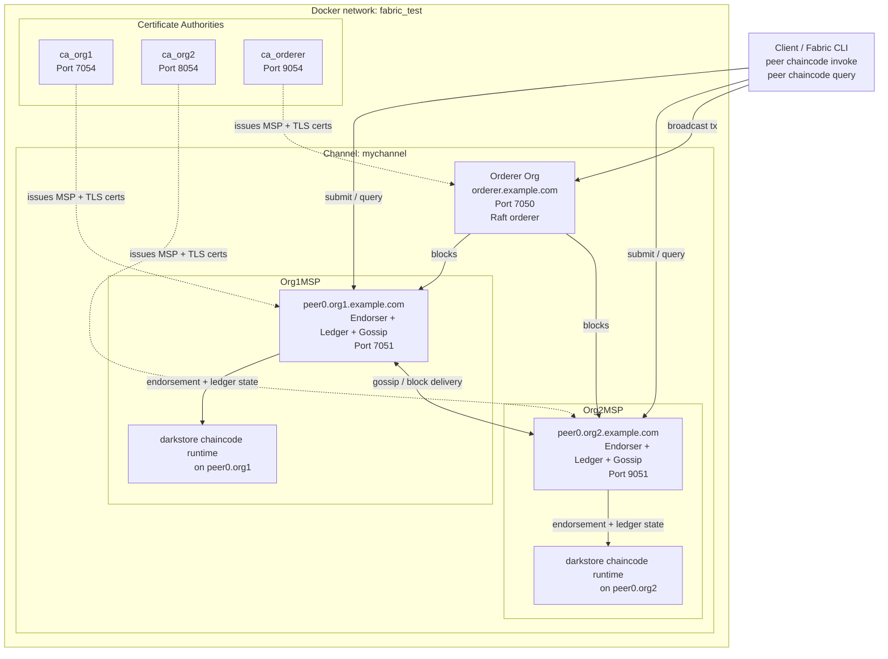
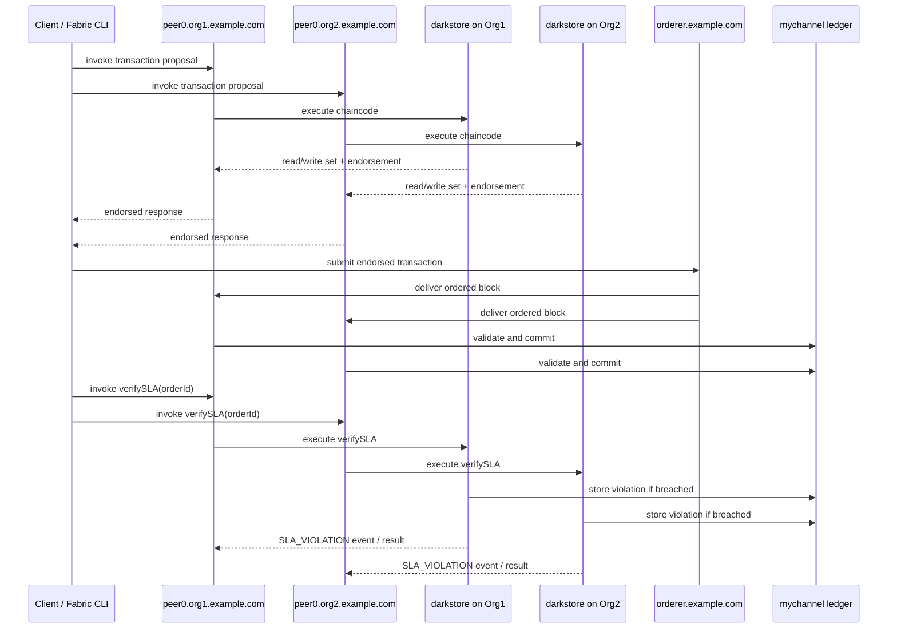
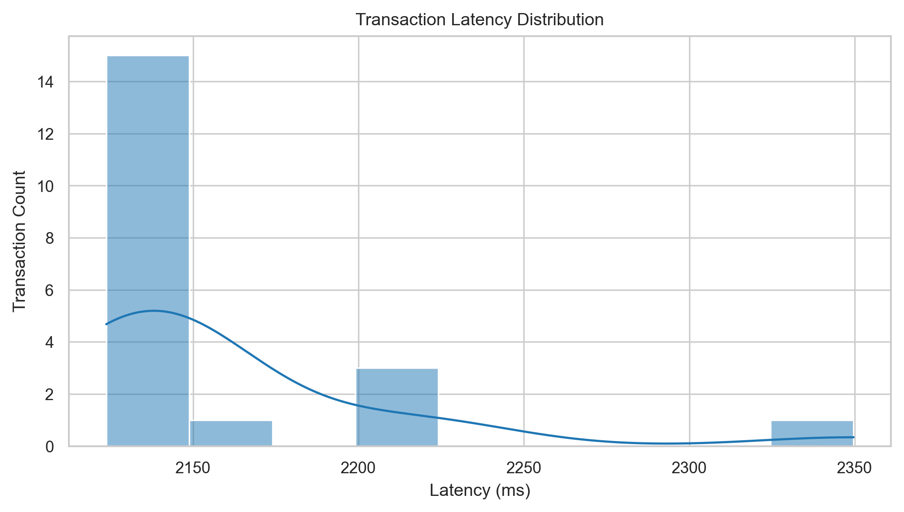
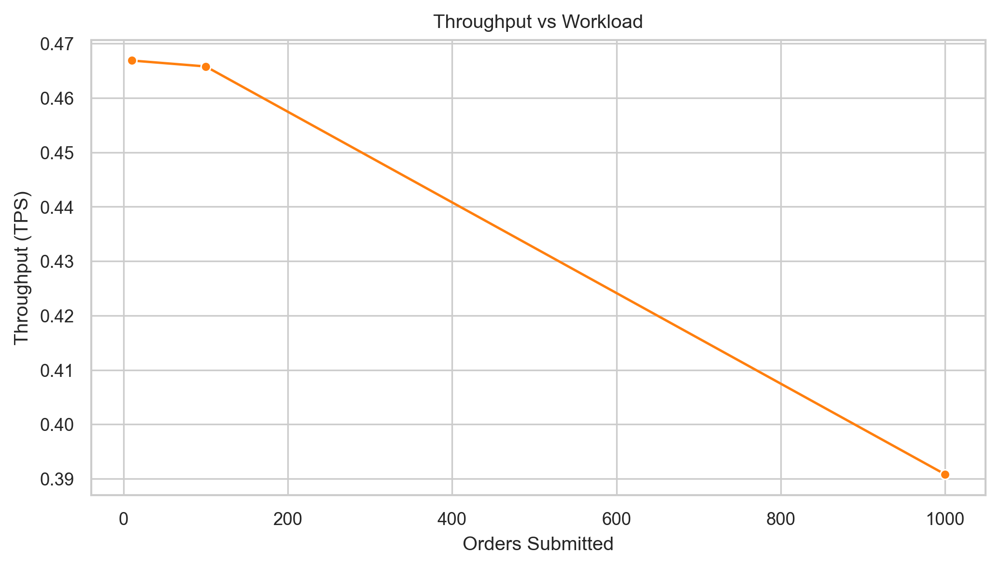

# Darkstore Governance Research System

Blockchain-based governance layer for quick-commerce dark store operations on Hyperledger Fabric.

## Placement

Clone Fabric samples:

```bash
git clone https://github.com/hyperledger/fabric-samples.git
```

Place this project at:

```text
fabric-samples/darkstore-governance/
```

## What Is Included

- `chaincode/`
  Java Fabric smart contract for order event logging, SLA verification, and violation storage/querying.
- `evaluation/`
  Python benchmarking framework for blockchain experiments plus centralized baseline simulation.
- `analysis/`
  Jupyter notebook for publication figures.
- `results/`
  Paper-facing output artifacts such as plots and logs.

## Architecture



## Transaction Flow



## Experimental Setup

- Network: Hyperledger Fabric test-network
- Channel: `mychannel`
- Chaincode: `darkstore`
- Organizations: `Org1MSP`, `Org2MSP`
- Peers: `peer0.org1.example.com`, `peer0.org2.example.com`
- Ordering service: `orderer.example.com`
- Event model:
  - `ORDER_PLACED`
  - `ORDER_PICKED`
  - `ORDER_PACKED`
  - `ORDER_DISPATCHED`
  - `ORDER_DELIVERED`
- SLA rules:
  - picking within 3 minutes
  - packing within 10 minutes after picking
  - dispatch within 5 minutes after packing
  - delivery within 30 minutes of placement

## Reproduce Results

From the repository root:

```bash
./darkstore-governance/run_experiments.sh quick
```

Full run:

```bash
./darkstore-governance/run_experiments.sh full
```

This script:

- starts the Fabric test network
- deploys the `darkstore` chaincode
- runs blockchain experiments
- runs a centralized baseline simulation
- exports paper-facing result artifacts into `darkstore-governance/results/`

## Results

Expected result artifacts:

```text
darkstore-governance/results/
  latency.png
  throughput.png
  logs.csv
```

Additional CSVs are stored in:

```text
darkstore-governance/evaluation/results/
```

## Sample Outputs

Sample graphs generated by the framework:

- `darkstore-governance/results/latency.png`
- `darkstore-governance/results/throughput.png`





## Baseline Comparison

A simple centralized reference implementation is included in:

```text
darkstore-governance/evaluation/centralized_baseline.py
```

It uses in-memory functions equivalent to:

- `store_event()`
- `check_sla()`

```python
# no blockchain
store_event(order_id, store_id, event_type, timestamp)
check_sla(order_id)
```

This provides a direct comparison between a centralized design and the blockchain system.

| Metric | Centralized | Blockchain |
| --- | --- | --- |
| Latency | low | higher |
| Throughput | high | lower |
| Trust | low | high |
| Auditability | limited | strong |

Use the generated CSVs and plots to report the measured values from your own environment.
