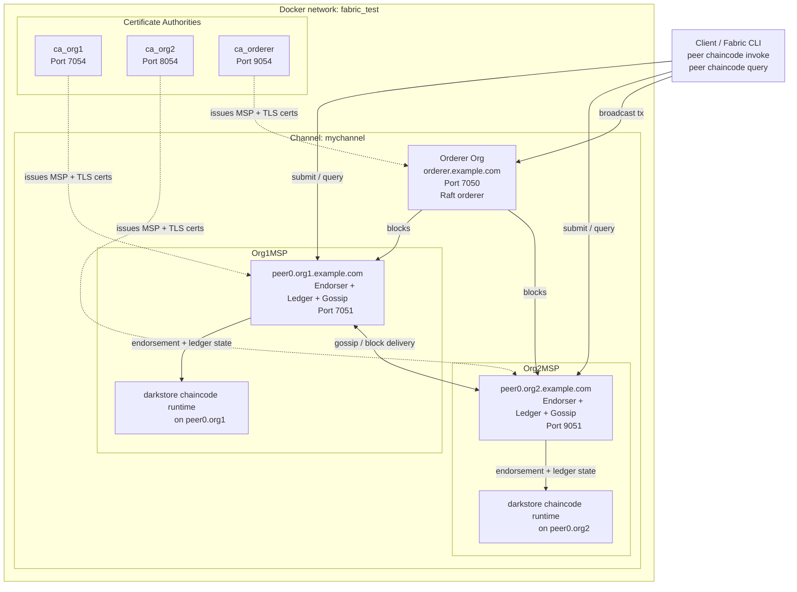

# Darkstore Governance Project

This folder consolidates the darkstore research work into one place.

## Repository Placement

Clone the Hyperledger Fabric samples repository first:

```bash
git clone https://github.com/hyperledger/fabric-samples.git
```

Add this project inside the cloned `fabric-samples` repository as:

```text
fabric-samples/darkstore-governance/
```

The README commands assume this exact placement so the project can reuse `test-network/`.

## What Each Folder Does

- `chaincode/`
  Darkstore Java chaincode for recording order events, verifying SLA compliance, and storing/querying violations.
- `evaluation/`
  Python benchmarking framework for latency, throughput, scalability, SLA accuracy, block confirmation, fault tolerance, and immutability tests.
- `analysis/`
  Jupyter notebook and exported analysis artifacts for paper figures.

## Run The Test Network

From the repository root:

```bash
cd test-network
./network.sh up createChannel -ca
./network.sh deployCC -ccn darkstore -ccp ../darkstore-governance/chaincode/darkstore-java -ccl java
```

To stop the network:

```bash
./network.sh down
```

## Run The Benchmark

From the repository root:

```bash
python3 darkstore-governance/evaluation/run_benchmark.py --mode quick
```

For the full benchmark:

```bash
python3 darkstore-governance/evaluation/run_benchmark.py --mode full
```

## Architecture


